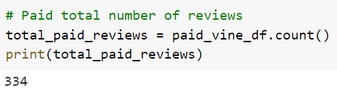
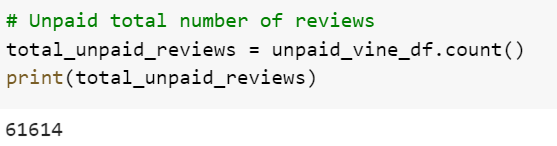
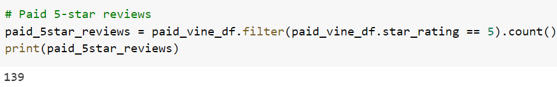
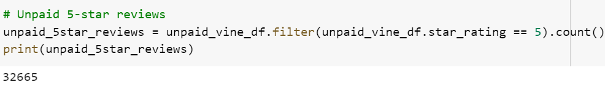
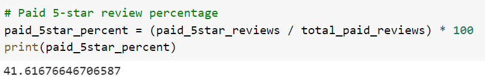
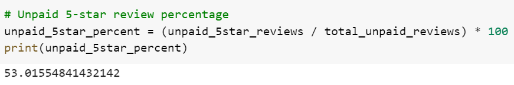

# Amazon_Vine_Analysis

## Overview of Amazon Vine Analysis
We were tasked with assisting SellBy in analyzing Amazon product reviews on select sports products. We will look at these reviews and compare the 5-star reviews from the paid vine member reviews vs. the unpaid member reviews. In order to do this we will use PySpark to perform the ETL process connecting to an AWS RDS instance, and load the transformed data into pgAdmin. Then we will determine any bias toward favorable reviews from the paid Vine members using PySpark.

## Results of Amazon Vine Analysis
After completeing the ETL process shown in Amazon_Reviews_ETL.ipynb, we then used PySpark to filter down the vine_table taking only product_ids with a 50% or greater helpful rating and more than 20 total_votes to create a new filtered DataFrame. We then took the new filtered DataFrame and created two DataFrames, one for Vine members and one for non-Vine members. Next we run the count functions and formulas shown below to get our results.

**Total Reviews**
- Paid Vine Members: 334
- Unpaid Members: 61,614

Counting the total number of rows in the Vine member and non-Vine member DataFrames will give us the total number of reviews.

**5-Star Reviews**
- Paid Vine Members: 139
- Unpaid Members: 32,665

Counting the number of rows in the Vine member and non-Vine member DataFrames when filtered for only 5-star ratings gives us the total number of 5-star reviews.

**Percent of 5-Star Reviews**
- Paid Vine Members: 41.6%
- Unpaid Members: 53.0%

We take our 5-star review count and divide by the total review count in order to get our percent of 5-star reviews.

## Summary of Amazon Vine Analysis
With the analysis above I would say there is no posivity bias for reviews amongst the paid vine members with only 41.6% of reviews being 5-star vs. 53.0% from the group that was not paid. For additional analysis, we could look at the distribution of reviews across each star rating for paid Vine members and unpaid members. We would also likely want to compare the reviews amongst other product categories, as we have only looked at the sports category.  
